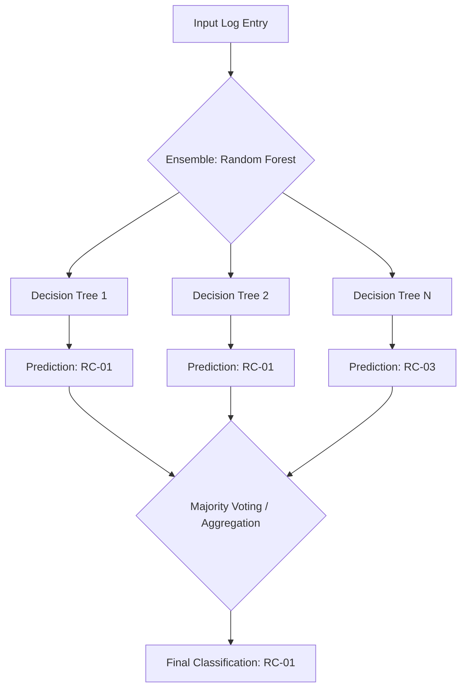

# Log Classification System: Technical Implementation Report

## Project Overview
This system provides an automated pipeline for classifying system error logs into eight predefined root cause categories (RC-01 through RC-08). Designed for an operations environment processing high volumes of digital activity, the prototype replaces manual investigation with a machine learning-based diagnostic tool.

## Project Structure
```
├── src/                    # Source code
│   ├── data/              # Data loading and preprocessing
│   ├── models/            # Model definitions and serialization
│   ├── training/          # Model training pipeline
│   ├── inference/         # Inference and prediction
│   ├── evaluation/        # Evaluation metrics and analysis
│   └── utils/             # Utility functions
├── docs/                  # Documentation and dataset
├── tests/                 # Test files
├── requirements.txt       # Python dependencies
├── scripts/               # Utility scripts for training, evaluation, inference
├── models/                # Saved trained models and inference pipeline
├── evaluation_results/    # Evaluation metrics and visualizations
├── models_compare/        # Model comparison results
└── README.md             # Project documentation
```
## Model Approach and Reasoning

### Problem Analysis
The implementation addresses several critical data constraints identified in the dataset:
* **Dataset Constraints**: The model was trained on a small dataset of 120 samples, averaging approximately 15 samples per class.
* **Feature Complexity**: The data includes mixed types: semi-structured text (log messages), categorical variables (service, severity), and temporal data (timestamps).
* **Class Imbalance**: The distribution across the 8 root cause categories contains slight variations that require algorithmic compensation.

### Selection Strategy
The **Random Forest** architecture was selected as the primary model after comparison with Logistic Regression and XGBoost. 

The decision was driven by specific technical advantages:
* **Mixed Feature Handling**: Superior performance in combining TF-IDF text vectors with categorical encodings.
* **Noise Robustness**: High resilience to the specific noise patterns found in small, technical datasets.
* **Analytic Transparency**: Native support for feature importance analysis, allowing for explainable AI outcomes.
* **Imbalance Management**: Effective use of the `class_weight='balanced'` parameter to prevent majority-class bias.

### Random Forest Model Architecture


---

## Data Preprocessing and Feature Engineering

### 1. Preprocessing Pipeline
* **Data Loading**: Utilizes a specialized `LogDataLoader` to handle CSV parsing for quoted fields with embedded commas.
* **Text Normalization**: Log messages are converted to lowercase with special characters and numbers removed to reduce vocabulary noise.
* **Pattern Matching**: Implements binary indicators for common error types such as "timeout," "connection failed," and "authentication failed".

### 2. Feature Vectorization
* **Text Features**: TF-IDF vectorization is tuned for a small corpus with the following parameters: `max_features=100`, `min_df=2`, and `max_df=0.95`.
* **Categorical Features**: One-hot encoding is applied to "service" and "severity" columns.
* **Temporal Features**: The system extracts the hour of day, day of week, and specific indicators for weekend activity or business hours (9 AM - 5 PM).
* **Total Features**: 107 features (100 TF-IDF + 3 categorical + 4 temporal).

### 3. Training Methodology
* **Split Ratio**: 70% training (84 samples) and 30% testing (36 samples).
* **Validation**: GridSearchCV with 3-fold stratified cross-validation was used for hyperparameter tuning.

---

## Evaluation Results

### Overall Performance Summary
The Random Forest model demonstrated strong generalization capabilities despite the limited sample size.

| Metric | Value |
| :--- | :--- |
| **Test Accuracy** | 83.3% |
| **Inference Accuracy** | 87.5% |
| **Macro F1-Score** | 81.1% |
| **Weighted Precision** | 85.7% |
| **ROC-AUC (One-vs-Rest)** | 98.2% |
| **Average Precision** | 93.7% |

### Per-Class Performance Data
| Root Cause | Precision | Recall | F1-Score | Support |
| :--- | :--- | :--- | :--- | :--- |
| **RC-01** | 83.3% | 100.0% | 90.9% | 5 |
| **RC-02** | 80.0% | 100.0% | 88.9% | 4 |
| **RC-03** | 80.0% | 80.0% | 80.0% | 5 |
| **RC-04** | 100.0% | 75.0% | 85.7% | 4 |
| **RC-05** | 83.3% | 100.0% | 90.9% | 5 |
| **RC-06** | 100.0% | 100.0% | 100.0% | 4 |
| **RC-07** | 66.7% | 80.0% | 72.7% | 5 |
| **RC-08** | 100.0% | 25.0% | 40.0% | 4 |

> **Analysis**: The model achieved perfect classification for RC-06 and strong performance for most classes. RC-08 showed the lowest recall (25%), indicating this class may have overlapping patterns with other categories (RC-02, RC-03, RC-07). This identifies a specific area where increased data collection or refined feature engineering is required.

---

## Strategic Tradeoffs and Limitations

### Engineering Tradeoffs
* **Complexity vs. Data Volume**: Chose traditional machine learning (Random Forest) over Deep Learning because traditional models generalize better with limited data (120 samples).
* **Interpretability vs. Accuracy**: Prioritized Random Forest to achieve higher performance while retaining feature importance insights.
* **Feature Engineering**: Used a hybrid approach (TF-IDF + manual patterns) to leverage domain knowledge, compensating for the lack of automated learning possible in larger datasets.

### System Limitations
* **Generalization**: Performance on real-world, non-synthetic logs remains unverified.
* **Temporal Modeling**: The current version treats logs as independent events, ignoring sequence patterns that often precede system failures.
* **Scalability**: The prototype is not yet optimized for high-volume streaming environments.
* **Edge Cases**: Handles unseen services, empty messages, and missing columns with graceful degradation.

---

## Productionization Roadmap

### Phase 1: Validation and Integration
* Implement A/B testing alongside current manual processes.
* Monitor for accuracy drift and per-class performance degradation.

### Phase 2: Infrastructure and Reliability
* Containerize the pipeline with **Docker** and serve via a REST API using **FastAPI**.
* Automate retraining and model versioning with tools like **MLflow**.

### Phase 3: Advanced Feature Set
* Introduce sequence modeling for temporal log patterns.
* Implement explainability dashboards using **SHAP** or **LIME** for operations teams.

---

## Usage Instructions

### Installation
```bash
python -m venv venv
source venv/bin/activate
pip install -r requirements.txt
```

### Execution
* **Training**: `python scripts/train_model.py --model-type random_forest`
* **Inference Pipeline**: `python scripts/create_inference_pipeline.py`
* **Inference**: `python scripts/run_inference.py`
* **Tests**: `pytest tests/ -v`
